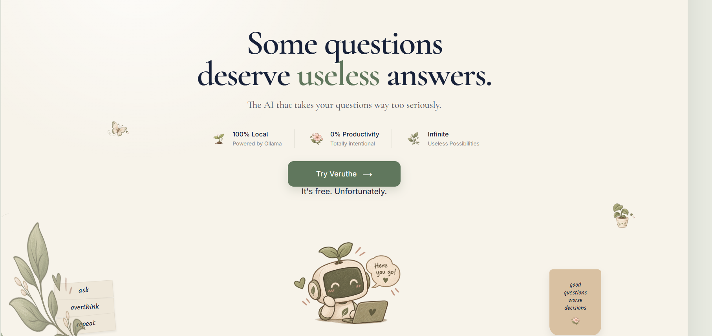
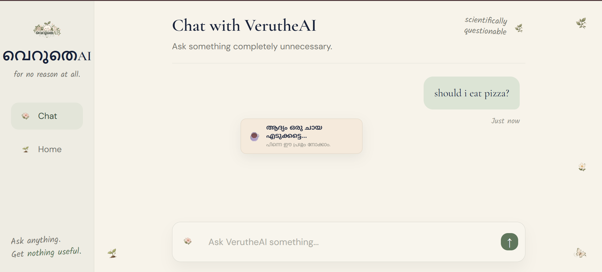
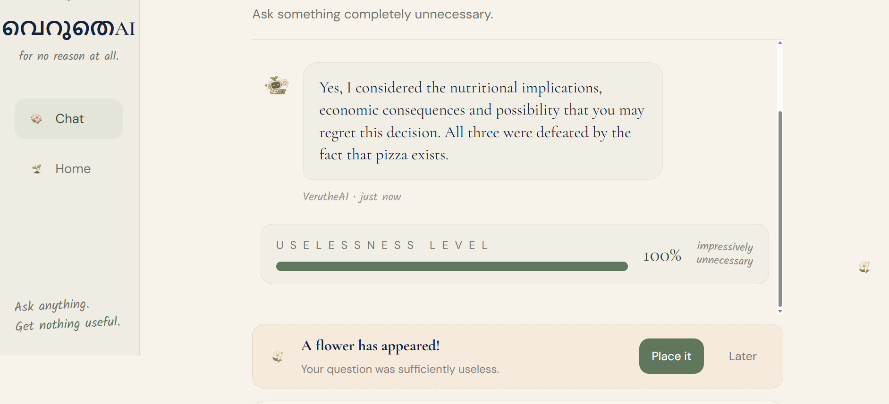

# [Project Name] 🎯

## Basic Details

### Team Name: Luna

### Team Members

- Team Lead: Fathima Farhana K N - Ilahia College of Engineering and Technology, Muvattupuzha
- Member 2: Fidha Fathima - Ilahia College of Engineering and Technology, Muvattupuzha

### Project Description

VerutheAI is an AI that answers questions nobody really needed answered.

Ask it something completely ordinary, and it responds with unnecessary seriousness, questionable logic, dramatic conclusions, and a completely legitimate-looking uselessness score.

### The Problem (that doesn't exist)

People keep asking normal questions and receiving normal answers.
This is clearly a problem.

VerutheAI addresses the severe lack of unnecessary overthinking in everyday conversations.

### The Solution (that nobody asked for)

VerutheAI takes ordinary questions and feeds them to a locally running AI instructed to be dramatically unhelpful while still answering the actual question.

Every response gets:

- **Uselessness Score** - How unnecessarily elaborate was the answer?
- **Chaos Score** - How far did the reasoning wander from sanity?
- **Verdict** - A completely unnecessary final conclusion.

And because answering questions isn't enough, sufficiently useless answers unlock tiny botanical decorations for the chat.

## Technical Details

### Technologies/Components Used

For Software:

- HTML
- CSS
- JavaScript
- Node.js
- Express.js
- Ollama
- Llama 3.2 3B
- CORS
- Git
- GitHub
- ngrok
- Vercel

For Hardware:
No additional hardware required.

### Implementation

For Software:

# Installation

[commands]

# Run

[commands]

### Project Documentation

For Software:

# Screenshots (Add at least 3)

# Screenshots (Add at least 3)

_VerutheAI landing page._

_The VerutheAI chat interface._

_AI response showing the uselessness score, chaos score, verdict, and decoration unlock._

# Diagrams

USER
↓
Ask a Question
↓
VERUTHEAI FRONTEND
(HTML + CSS + JavaScript)
↓
NODE.JS + EXPRESS BACKEND
↓
OLLAMA
↓
LLAMA 3.2 3B
↓
GENERATE RIDICULOUS RESPONSE
↓
USELESSNESS + CHAOS SCORES
↓
VERDICT + DECORATION UNLOCK
↓
DISPLAY RESPONSE TO USER

### Project Demo

# Video

[Add your demo video link here]
_Explain what the video demonstrates_

## Team Contributions

### Team Contributions

- Fathima Farhana K N:
  - Project lead and project planning
  - Frontend development using HTML, CSS and JavaScript
  - UI/UX design and VerutheAI visual design
  - Integration of the frontend with the backend
  - Deployment and live demo setup

- Fidha Fathima:
  - Backend development using Node.js and Express.js
  - Ollama and Llama 3.2 3B integration
  - VerutheAI system prompt and AI response generation
  - JSON response and scoring logic
  - Testing and debugging

---

Made with ❤️ at TinkerHub Useless Projects

